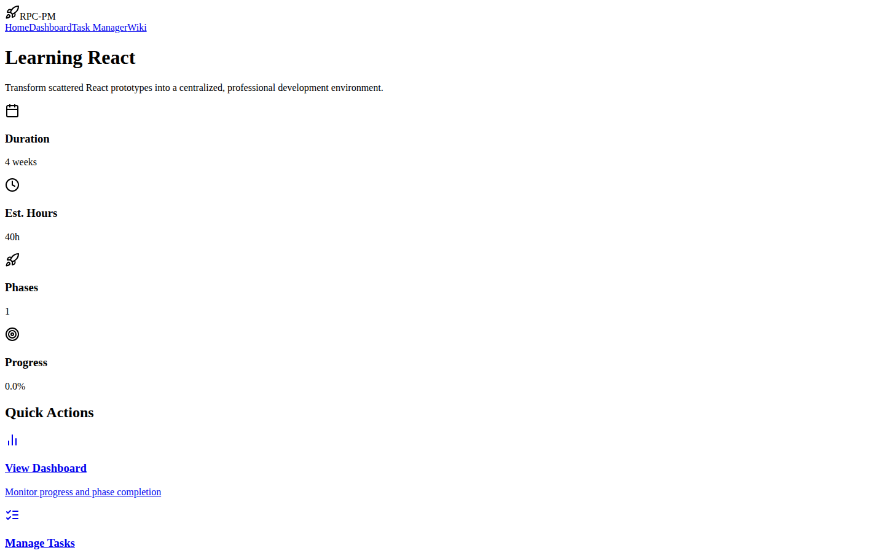

# React Project Management App

A multi-page project management application with a dashboard, task manager, and wiki — built as a dark-themed single-page app using React and React Router.



## Live Demo

**Live:** [https://kareembullard.github.io/pm-dashboard/](https://kareembullard.github.io/pm-dashboard/)

`index.html` is the standalone build served directly from GitHub Pages — no build step, no install needed. `pm-dashboard-standalone.html` and `project-management-app_React_index.html` are redirect stubs pointing to `index.html`, kept only so old bookmarks/links don't 404. The original React/Vite source lives in `react-src/`.

## Features

- **Homepage** — Project overview and status summary
- **Dashboard** — Visual project tracking with charts (Recharts)
- **Task Manager** — Create, assign, and track tasks
- **Wiki** — Internal knowledge base / documentation hub
- Persistent state via React Context
- Dark UI with Tailwind CSS (gray-900 theme)
- Fully responsive layout

## Tech Stack

| Layer | Technology |
|---|---|
| Framework | React 18 + TypeScript |
| Routing | React Router DOM 6 |
| Charts | Recharts |
| Icons | Lucide React |
| Build | Vite 6 |
| Styling | Tailwind CSS |

## React Version — Local Setup

**Prerequisites:** Node.js 18+

```bash
npm install
npm run dev
```

## Project Structure

```
├── App.tsx                  # Router + layout shell
├── components/
│   ├── layout/
│   │   └── Navigation.tsx   # Top nav bar
│   └── pages/
│       ├── Homepage.tsx
│       ├── Dashboard.tsx
│       ├── TaskManager.tsx
│       └── Wiki.tsx
├── context/
│   └── ProjectContext.tsx   # Global state management
└── data/
    ├── initialData.ts       # Seed project + task data
    └── initialState.ts      # Default app state
```

## About

Built by Kareem Bullard as part of the King Projects portfolio — demonstrating full-stack React architecture, routing, and state management patterns for project management tooling.
